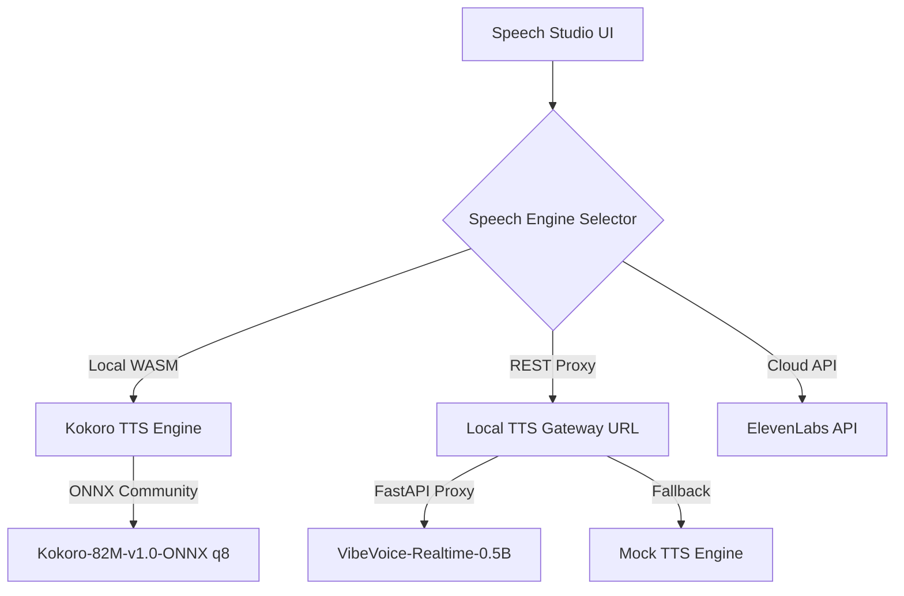

# Speech Studio & Text-to-Speech (TTS) Integration Guide

Zumilabs Studio includes a powerful **Speech Studio** within the Timeline Editor (`#tme`), allowing you to translate script text or timed subtitle files (SRT) into lifelike spoken dialogue. 

This guide documents the TTS architecture, supported speech engines, and configuration steps.

---

## 1. TTS Engine Architecture

Speech Studio supports a hybrid architecture consisting of **local in-browser engines**, **cloud-based API providers**, and **self-hosted local proxy gateways**.



---

## 2. Supported Engines

### A. Kokoro TTS (Default, In-Browser)
* **Type**: Local WebAssembly / ONNX Runtime
* **Models**: `onnx-community/Kokoro-82M-v1.0-ONNX` (quantized to Q8)
* **Characteristics**: Fast, lightweight (~82 million parameters), runs entirely in the browser without requiring external servers.
* **Best For**: Standard, responsive narration where internet or local GPU servers are unavailable.

### B. Local TTS Gateway (Advanced Offline Voice Synthesis)
* **Type**: Self-hosted Local REST Proxy Server
* **Default Model**: Microsoft's `VibeVoice-Realtime-0.5B`
* **Characteristics**:
  * **Dynamic Cache**: Automatically downloads and caches official voice presets (25 available speakers) and model weights on-demand.
  * **Device Acceleration**: Automatically matches device hardware, utilizing **Metal Performance Shaders (MPS)** on Apple Silicon or CUDA on Nvidia GPUs.
  * **Extensible Registry**: Built with an engine registry system, allowing you to add custom Python-based TTS runtimes (like Bark or XTTS) seamlessly.
* **Best For**: High-fidelity, highly natural voices with precise pitch, emotion, and speaker cloning capabilities.

### C. ElevenLabs (Cloud API)
* **Type**: Commercial Cloud API
* **Best For**: State-of-the-art voice synthesis when an internet connection and active API subscription are available.

---

## 3. Configuration & Setup

### Setting up the Local TTS Gateway:
1. Navigate to the local proxy directory:
   ```bash
   cd /Users/amithcabraal/code/personal/local-tts-gateway
   ```
2. Setup and install dependencies:
   ```bash
   ./installServer.sh
   ```
3. Run the gateway server:
   ```bash
   ./startServer.sh
   ```
   *The gateway will boot and listen at `http://localhost:8000`.*

### Integrating with Zumilabs Studio:
1. Open **Zumilabs Studio Settings** (`Global Settings` page).
2. Scroll to the **AI Integration** section.
3. Under **Local TTS Gateway URL**, enter: `http://localhost:8000` (or the IP address of your hosting machine).
4. Click **Save Configurations** at the top right.
5. In **Speech Studio**, tick the checkbox for **Local TTS Gateway (Self-hosted)** to load and map the gateway voices.
