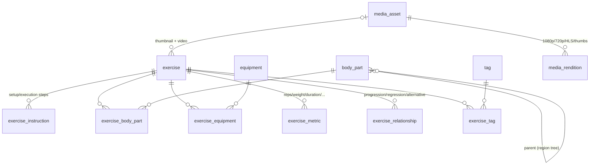
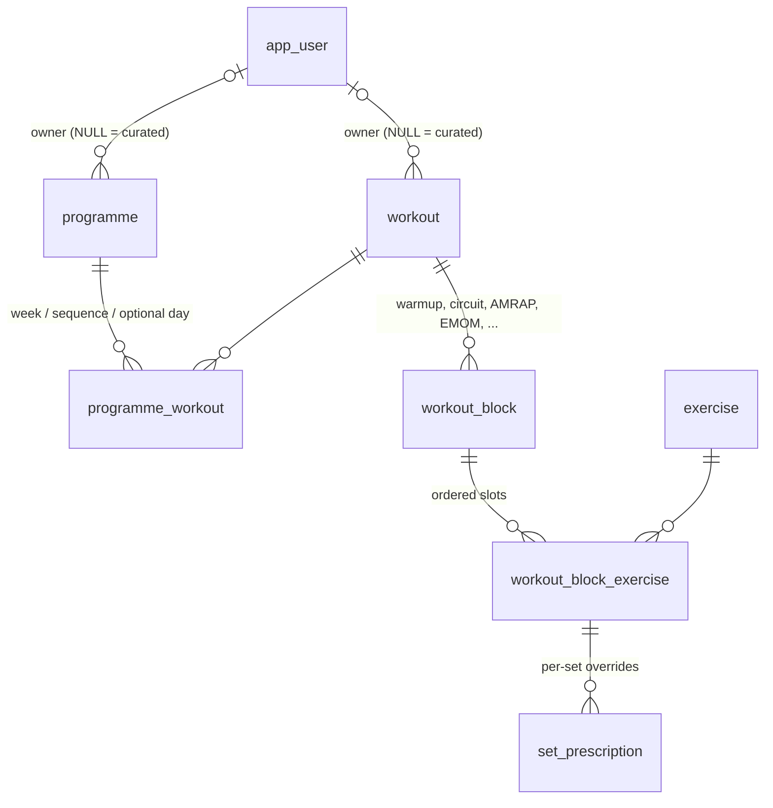
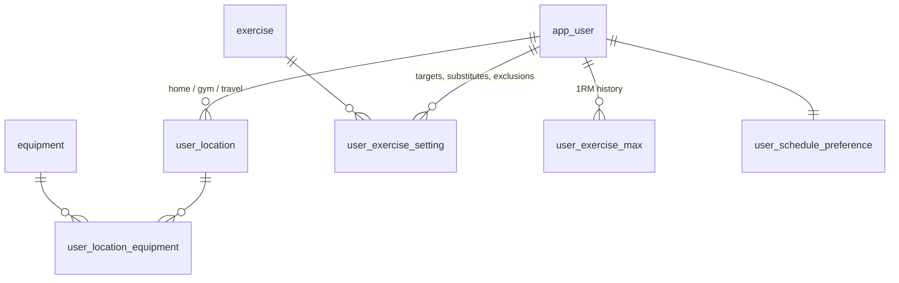
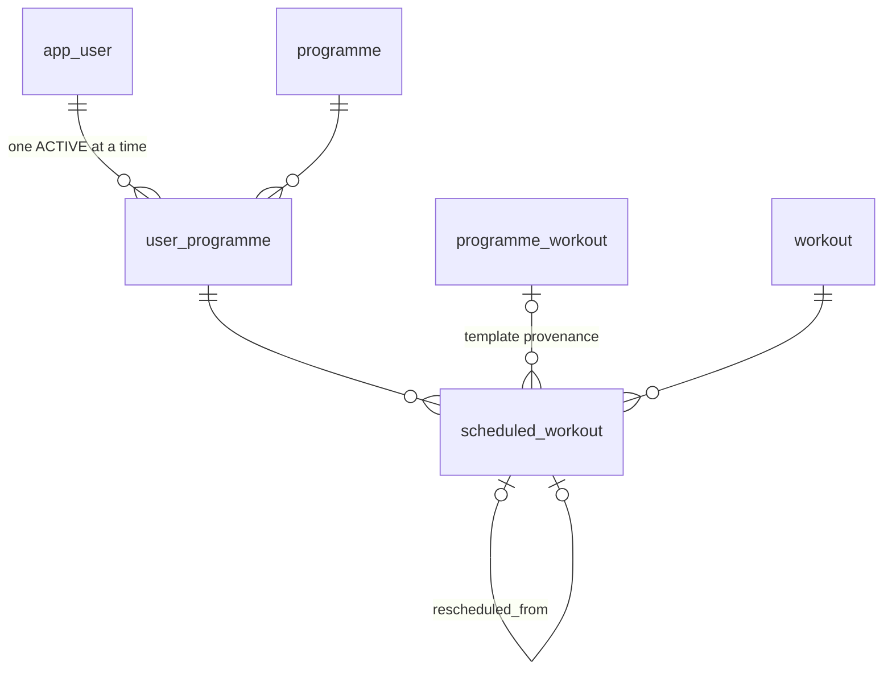
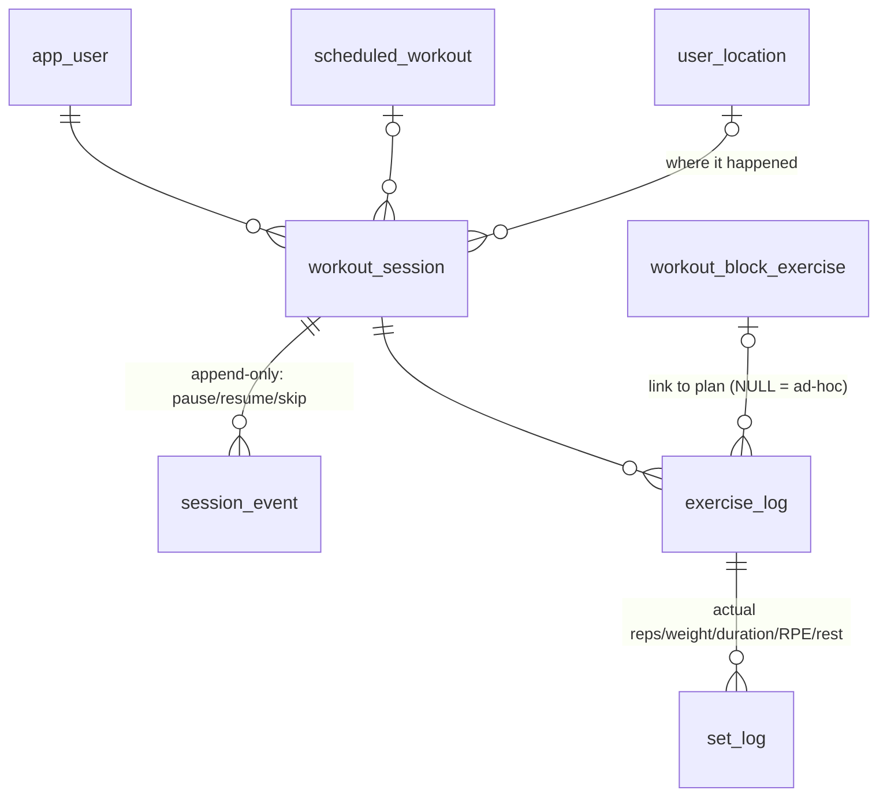
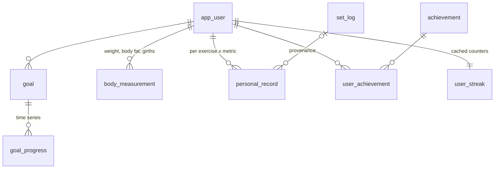

# Exercise App — Data Model

Full database design for an exercise app built around **programmes → workouts →
exercises**, with smart scheduling, ad-hoc workouts by equipment/location,
per-user exercise variations, pause/resume sessions, and progress tracking.

The authoritative DDL is [`schema.sql`](schema.sql) (PostgreSQL 15+, validated
against PostgreSQL 16). The exercise content that seeds it is described in
[`exercise-database.md`](exercise-database.md).

---

## 1. How the requirements map to the model

| Requirement | Where it lives |
|---|---|
| Programme contains workouts, workout contains exercises | `programme` → `programme_workout` → `workout` → `workout_block` → `workout_block_exercise` |
| Exercise title, thumbnail, video | `exercise.name`, `exercise.thumbnail_asset_id`, `exercise.video_asset_id` → `media_asset`/`media_rendition` |
| Setup instructions (optional) + performance instructions | `exercise_instruction` with `phase` = `setup` / `execution` (plus `breathing`, `safety`) |
| Body parts worked | `exercise_body_part` (`primary` / `secondary` / `stabiliser`) over the `body_part` tree |
| Mandatory rest after exercise | `exercise.min_rest_seconds` (hard floor) + `exercise.default_rest_seconds`; prescriptions may extend but never go below the floor |
| User-specific variations (weights, star-jump targets) | `user_exercise_setting` (target weight/reps/duration/distance, band level, preferred substitute, exclusions) + `user_exercise_max` for %1RM work |
| Any modality (HIIT, strength, cardio, …) | `exercise.modality` enum + flexible `exercise_metric` (reps, weight, duration, distance, calories, pace, height, rounds) |
| Choose a programme or create their own | `programme.owner_user_id` NULL = curated; set = user-authored; `visibility` controls sharing |
| Smart, flexible scheduling | `user_schedule_preference` (inputs) + `scheduled_workout` (output occurrences, reschedulable with audit trail) |
| Ad-hoc workouts by equipment/location | `user_location` + `user_location_equipment` filtered against `exercise_equipment`; `exercise_relationship` powers substitutions |
| Pause and resume | `workout_session.state` + append-only `session_event` log (also `user_programme.status = paused` at programme level) |
| Lots of progress and targets | `goal`/`goal_progress`, `body_measurement`, `personal_record`, `user_streak`, `achievement`, and full `set_log` history |

---

## 2. Architecture at a glance

Three layers, kept strictly separate:

1. **Content library** (system + user authored, versionable, mostly static):
   exercises, media, programmes, workouts, prescriptions.
2. **User plan** (what *should* happen): enrollments, preferences, scheduled
   occurrences, per-user exercise settings.
3. **Execution log** (what *did* happen, append-only): sessions, events,
   exercise/set logs — from which all progress, records, streaks and goal
   updates are derived.

The cardinal rule: **templates are never mutated by execution**. A
`workout_session` references the plan (`workout_block_exercise`) but stores its
own actuals (`set_log`), so editing a programme later never corrupts history.

---

## 3. Domain diagrams

### 3.1 Exercise content library

Key decisions:

- **`exercise_metric`** decouples *what an exercise is* from *how it is
  measured*. A squat is reps+weight, a plank is duration, a shuttle run is
  distance+duration. This is what lets one prescription/logging pipeline serve
  HIIT, strength and cardio without sparse one-size-fits-all columns.
- **`exercise_relationship`** (progression / regression / alternative /
  antagonist / variation) is the engine behind smart substitution: no
  pull-up bar at this location → offer the `alternative` edge; too hard →
  follow `regression`.
- **`min_rest_seconds` vs `default_rest_seconds`**: the mandatory rest is a
  per-exercise floor enforced at validation time; workout authors can extend
  rest per slot (`workout_block_exercise.rest_after_seconds`) but never reduce
  it below the floor.
- **Media is first-class** because video is original content: a logical
  `media_asset` goes through `uploading → processing → ready` and fans out to
  `media_rendition` rows (HLS, MP4 qualities, thumbnail sizes) for delivery.
- Full-text + trigram indexes on `exercise` give instant search; `tag` covers
  cross-cutting facets like `low-impact`, `no-jumping`, `apartment-friendly`.

### 3.2 Programme & workout templates

Key decisions:

- **`workout_block` is the structural unit**, not the exercise. Real workouts
  are warmups, straight sets, supersets, circuits, AMRAPs, EMOMs, Tabatas,
  pyramids, cooldowns — the `block_type` plus `rounds` / `work_seconds` /
  `rest_between_rounds_seconds` / `time_cap_seconds` expresses all of them with
  one table.
- **Prescription is two-level**: defaults on `workout_block_exercise` (sets,
  rep range, duration, distance, tempo, load) with optional per-set
  `set_prescription` rows for pyramids/top-sets/drop-sets.
- **`load_basis`** makes loads portable across users: `percent_1rm` resolves
  against `user_exercise_max`, `user_setting` resolves against
  `user_exercise_setting` (e.g. "your goblet squat weight"), `rpe` and
  `absolute` are taken as-is.
- **`programme_workout.day_of_week` is nullable** — that is the "flexible
  scheduling" switch. Fixed programmes pin days; flexible programmes leave it
  NULL and the scheduler chooses.

### 3.3 Users, locations & variations

Key decisions:

- **Equipment hangs off locations, not the user.** "What can I do right now?"
  is `location → equipment → exercises whose required equipment ⊆ available`,
  which makes hotel-room ad-hoc workouts a single query.
- **`user_exercise_setting` is the single home for per-user variation**:
  target weight for goblet squats, target count for star jumps, extra rest,
  a preferred variation that should always be swapped in, or a hard exclusion
  with a reason ("knee injury") that the generator must respect.

### 3.4 Enrollment & smart scheduling

The scheduler is deliberately *outside* the database: it reads
`user_schedule_preference` (available days, time-of-day, session budget,
minimum recovery gap between strength days) plus the programme structure, and
writes plain `scheduled_workout` rows. Missed a day? The row flips to
`missed`/`rescheduled` and a new row is written with `rescheduled_from_id`
pointing back — full audit trail, and adherence analytics fall out for free.
A partial unique index guarantees one `active` programme per user, while
`user_programme.status = 'paused'` freezes scheduling without losing position
(`current_week`).

### 3.5 Execution: sessions, pause/resume, logging

Key decisions:

- **Pause/resume is event-sourced.** `session_event` is the source of truth
  (`started`, `paused`, `resumed`, `exercise_skipped`,
  `exercise_substituted`, `rest_started`, `rest_skipped`, …) with cached
  aggregates (`active_seconds`, `paused_seconds`) on the session row. A phone
  dying mid-workout is recoverable from the event stream, and "did users
  actually take the mandatory rest?" is answerable (`set_log.rest_taken_seconds`
  vs prescription).
- **`exercise_log.block_exercise_id` is nullable** — the link to the plan when
  following a workout, NULL when the user bolts on an extra exercise mid-session.
  `substituted_for_id` records swaps without losing the original intent.
- `set_log` carries every metric column (reps, weight, duration, distance,
  RPE); which ones are meaningful is dictated by the exercise's
  `exercise_metric` rows.

### 3.6 Progress, goals & gamification

Goals are typed (`body_weight`, `exercise_performance`, `workout_frequency`,
`programme_completion`, `streak`, …) and mostly auto-fed: on session
completion a worker derives `goal_progress`, detects `personal_record`s
(linked back to the exact `set_log` for provenance), updates `user_streak`,
and evaluates `achievement.criteria` (JSONB rules → `user_achievement`).

---

## 4. Conventions & operational notes

- **Keys**: UUIDv4 PKs for user-generated/high-volume rows; small identity
  PKs for reference data (`body_part`, `equipment`, `tag`, `achievement`);
  human-readable unique `slug`s for anything addressable in a URL or seed file.
- **Enums** for closed vocabularies (modality, block type, session state…);
  **lookup tables** for open vocabularies that grow with content (equipment,
  body parts, tags).
- **Units**: stored metric (kg, metres, seconds); `app_user.unit_preference`
  drives display conversion only.
- **Deletion**: content is `archived` via `content_status`, never deleted —
  history references it. User deletion cascades through all owned rows.
- **Hot paths indexed**: today's calendar (`scheduled_workout` partial index),
  session history, measurement series, PR lookups, exercise search (GIN
  full-text + trigram).
- **Scaling**: `session_event` and `set_log` are the high-volume tables;
  both are append-only and partition cleanly by month if needed. Everything
  else is small.

## 5. What is intentionally *not* in v1 of the schema

Social features (following, shared feeds), wearable/HR integration, nutrition,
in-app purchases, and coach/client relationships. The layering above (content
/ plan / log) means each can be added as a sibling domain without touching
existing tables — e.g. wearables would attach a `session_metric_sample` table
to `workout_session`.
