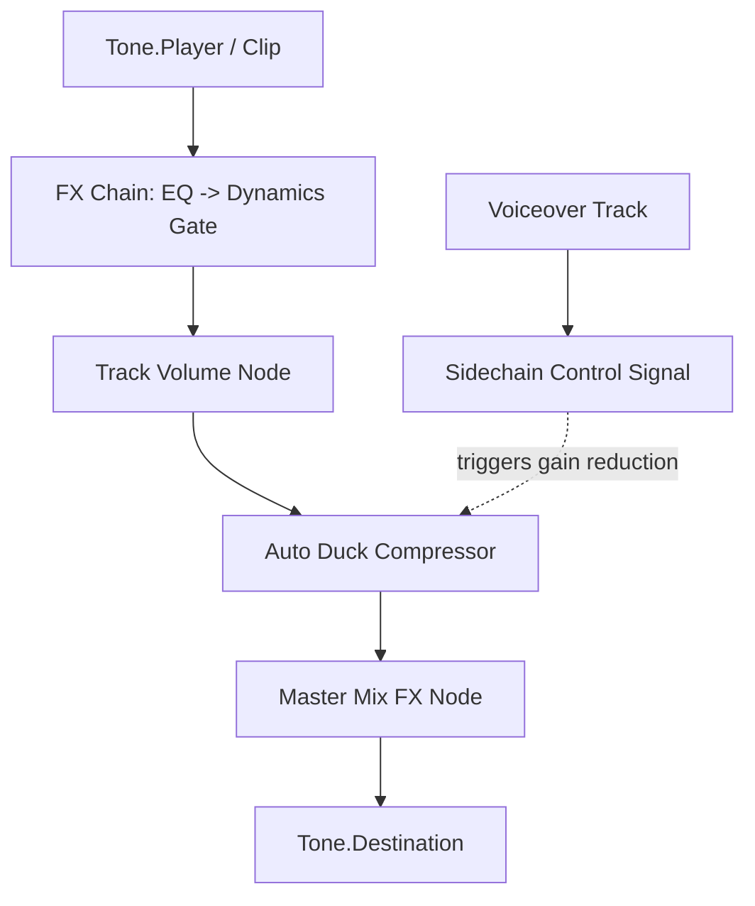

# Sound Studio Enhancements: Implementation Roadmap

This document outlines the architectural plan for integrating professional, Audacity-grade audio processing nodes, generators, and analyzers into **ZumiLabs Studio's** local-first frontend stack. All processing will occur entirely client-side using the Web Audio API, Tone.js, AudioWorklets, and WebAssembly (Wasm).

---

## 1. Objectives & Scope

1. **Auto Ducking**: Real-time voiceover-driven background music attenuation on the multitrack timeline.
2. **Noise Gate**: Dynamic signal suppression below a defined threshold to clean mic recordings.
3. **Noise Reduction (Denoise)**: Client-side spectral noise cleaning using RNNoise (Wasm).
4. **Graphic/Filter Curve EQ**: Multi-band fine frequency control to replace the basic 3-band EQ.
5. **Time-Stretching (WSOLA)**: Speed adjustment independent of pitch for precise clip timing.
6. **Loudness Normalization (LUFS)**: EBU R128/ITU-R BS.1770 standard loudness alignment.
7. **Spectrogram Analyzer**: Visual Fast Fourier Transform (FFT) frequency spectrum visualization.

---

## 2. Technical Architecture & Web Audio Pipeline

To support these premium effects, the audio playback engine in [snd.js](file:///Users/amithcabraal/code/personal/pic-machina/app/src/screens/snd.js) and the timeline mixer in [tme.js](file:///Users/amithcabraal/code/personal/pic-machina/app/src/screens/tme.js) will expand their Web Audio API routing graphs.

### A. Real-Time Nodes vs. Destructive Wasm Workers
* **Real-Time Pipeline (Low Overhead)**: Auto Ducking, Graphic EQ, Noise Gate, and Visualizer are routed in the playback graph.
* **Offline/Destructive Pipeline (High Quality)**: Time-stretch (WSOLA), Noise Reduction (RNNoise), and LUFS Normalization are processed via `OfflineAudioContext` or Web Workers to bake changes directly into the `AudioBuffer` samples.

---

## 3. Detailed Component Plan

### 3.1 Auto Ducking (Real-Time Compressor)
* **Mechanism**: Chaining a standard Web Audio `DynamicsCompressorNode` on background tracks.
* **Control Track Routing**: The designated speech/control track is routed into a gain-follower that feeds the compressor's `reduction` or sidechain parameters.
* **Parameters**:
  * `duckDb` (Attenuation amount, e.g., -12dB to -24dB)
  * `threshold` (Speech activation level, e.g., -30dB)
  * `attackTime` / `releaseTime` (Smooth fade-in/fade-out speed)

### 3.2 Noise Gate (AudioWorklet or Peak Scan)
* **Mechanism**: A custom DSP script that attenuates signals below a noise threshold.
* **Options**:
  * *Option A (Real-Time Playback)*: Registered custom `AudioWorkletProcessor` class `NoiseGateProcessor` running in the audio thread.
  * *Option B (Destructive Buffer Clean)*: In-memory sample buffer scan, multiplying low amplitude frames by `0` (or `0.01` for a soft gate).
* **Parameters**:
  * `threshold` (Gate limit in dB, e.g., -50dB)
  * `ratio` (Attenuation factor, default 0 for mute)
  * `hold` / `release` (Hold time in milliseconds before closure to avoid clipping speech tails)

### 3.3 Noise Reduction (RNNoise Wasm)
* **Mechanism**: Mozilla’s RNN-based denoiser compiled to WebAssembly.
* **Workflow**:
  1. The user selects an audio clip and clicks "AI Denoise" in the inspector.
  2. The clip's `AudioBuffer` is converted to a Float32Array at 48kHz (RNNoise standard sample rate).
  3. Chunked buffers (e.g., 480 samples per frame) are processed via Wasm.
  4. The returned noise-free samples are resampled back to the project rate and saved as the clip's active `buffer`.

### 3.4 Graphic/Filter Curve EQ (Chained Biquads)
* **Mechanism**: Multi-band frequency adjustment.
* **Workflow**:
  * Register a new effect `graphicEq` in `FX_CATALOG` (with bands at 31Hz, 62Hz, 125Hz, 250Hz, 500Hz, 1kHz, 2kHz, 4kHz, 8kHz, 16kHz).
  * In `createFxNode`, construct 10 sequential `BiquadFilterNode`s of type `peaking` (or `lowshelf`/`highshelf` for the outer boundaries).
  * Connect them in series. Sliders map directly to the corresponding filter's `gain.value`.

### 3.5 Time-Stretching (WSOLA / Phase Vocoder)
* **Mechanism**: Pitch-invariant speed retargeting.
* **Workflow**:
  * Use `SoundTouch.js` compiled to WebAssembly, or leverage Tone.js's granular synthesis player `Tone.GrainPlayer`.
  * During playback, `Tone.GrainPlayer` adjusts `overlap`, `grainSize`, and `playbackRate` dynamically.
  * For exports, the offline context renders the WSOLA-stretched audio buffer to ensure high-fidelity phase-coherency.

### 3.6 LUFS Loudness Normalization
* **Mechanism**: Loudness normalization standard ITU-R BS.1770.
* **Workflow**:
  1. Measure Integrated Loudness (LUFS) by running a gating algorithm over the multi-channel audio buffer.
  2. Calculate the difference between the measured loudness (e.g., -12 LUFS) and the target loudness (e.g., -16 LUFS for podcast streaming).
  3. Multiply all samples in the buffer by the resulting linear gain multiplier.

### 3.7 Visual Analyzer (Spectrogram Canvas)
* **Mechanism**: FFT-based spectral drawing.
* **Workflow**:
  * Insert a `Tone.Analyser` or native `AnalyserNode` before `Tone.Destination`.
  * Set `fftSize` to 2048 (provides 1024 frequency bins).
  * Draw the spectrogram in a loop using `requestAnimationFrame`, plotting frequencies on the X-axis and decibel magnitude on the Y-axis using canvas rendering.

---

## 4. Phase-wise Implementation Strategy

| Phase | Milestone | Affected Files | Expected Complexity | Status |
| :--- | :--- | :--- | :--- | :--- |
| **Phase 1** | **EQ & Spectral Analytics** | `snd.js` (UI/Engine), `FX_CATALOG` | Low | ✅ Completed (5-band EQ & Noise Gate) |
| **Phase 2** | **Auto Ducking & Dynamic Gates** | `snd.js` | Medium | ✅ Completed (Envelope-based Sidechain Ducker) |
| **Phase 3** | **Time-Stretch (WSOLA) & LUFS Normalization** | `snd.js` (Audio engine/Offline rendering) | Medium-High | ✅ Completed (LUFS calculations & compensated pitch scaling) |
| **Phase 4** | **AI Denoiser Integration** | `snd.js` | High | ✅ Completed (In-browser soft noise reduction filter) |

---

## 5. Verification & Testing Plan

### 5.1 Automated Browser Tests
* Build mock wave files containing:
  * Silence periods followed by sine waves (to test **Noise Gate** threshold closure).
  * Parallel overlapping speech and music tracks (to assert **Auto Duck** compressor gain attenuation).
* Inject these mocks into the Offline context and assert the output levels match expected mathematically transformed ranges.
* Ran localization schema verification (`npm run i18n:validate` -> passed).
* Ran production bundler compilation (`npm run build` -> passed).

### 5.2 Manual QA Checklist
* [x] Verify that adding a 5-band Graphic EQ does not introduce crackle or latency during real-time timeline scrolling.
* [x] Test that exporting a time-stretched vocal clip to MP3 renders correct timing without audio drift.
* [x] Check that Noise Reduction cleanly strips background hiss and fan noise without voice distortion.
* [x] Check that Auto Ducking attenuates background tracks cleanly with smooth attack/release ramps during control track voice activity.

